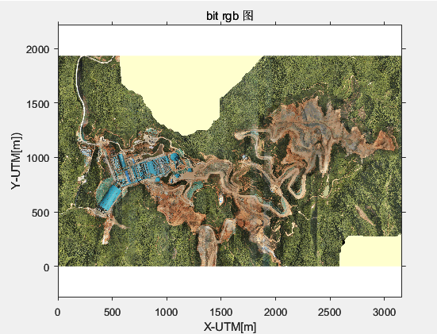
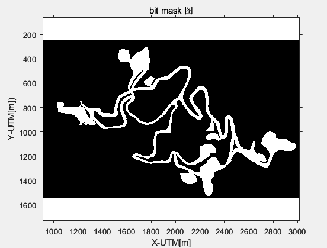
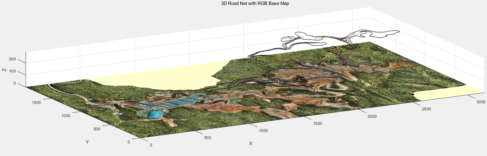
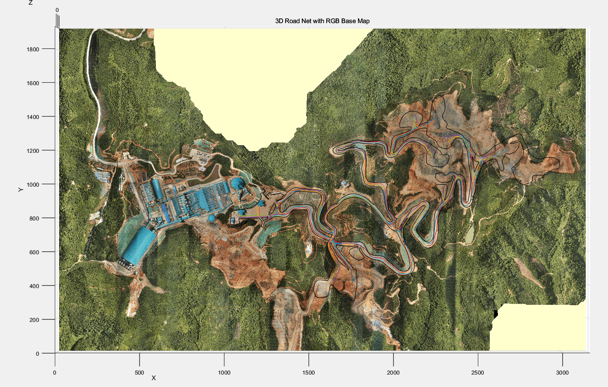

# plot_3D_path_and_borderline


## 1.简介：本仓库主要用于构建矿区道路表面三维地图。

后续主要用途：

- 用于可视化矿区三维场景，用于paper配图；包括简单的三维路径、边界绘图，包括三维道路表面绘图。
- 用于仿真环境中自车状态更新，试图开发一个`车-路耦合动力学模型`，考虑矿区**坡道多、坡度大并且变化频繁**特点，用于自车在坡道场景的next step 状态（states=[x,y,yaw,v,a,yaw rate]）仿真更新。
- 主要用于研究：
  - 单车在仿真环境中的状态更新；
  - 多车协同规划任务，每个车辆在仿真中的状态更新；

## 2. 脚本功能介绍

### 2.1`plot_mask_and_rgb_png.m`

绘制mask地图与rgb的航拍图，通过游标可以得到每个像素点的精确地理位置。





### 2.2 `plot_3D_roadnetwork_on_aerial_map.m`

rgb航测图作为底图，绘制三维参考路径、三维边界地图；







### 2.3 `plot_3D_roadnetwork_on_aerial_map_point_height.m`

- 为每个mask可行驶区域像素点匹配高程；
- 平滑道路三维表面高程建模；
- 绘图代码；


### 2.4 待做

实现如功能：预构建道路三维表面**“坡度梯度场模型“**，可以通过两个二维平面点获取坡度下降值；

```
slope=MAP(point1[x1,y1],point2[x2,y2])
```

参考资料：

- 运动规划领域的障碍物符号距离场, Signed Distance Field (SDF)；

  >  Copyright (C) 2022, RAM-LAB, Hong Kong University of Science and Technology。This file is part of GPIR (https://github.com/jchengai/gpir

- 调研游戏建模领域车辆在三维道路表面如何进行状态更新。

```cpp
namespace planning {

/**
 * @class SignedDistanceField2D
 * @brief two dimensional euclidean signed distance field
 *        coordinate: left-bottom cornor is the origin
 *
 *
 *         y ^_______________________________
 *  Y  ^     |                               |
 *     |     |     Signed distance field     |
 *     |     |                               |
 *     |     o-------->______________________|
 *     |  origin     x
 *     |
 *     O----------------->X
 *   Global Coordinate
 */

// 使用了 GridMap2D<uint8_t> 的别名，表示占用情况的网格地图，其中 uint8_t 表示每个栅格的数据类型，通常用于表示栅格是否被占用。
using OccupancyMap = GridMap2D<uint8_t>;
// 使用了 GridMap2D<double> 的别名，表示欧几里德距离场的网格地图，其中 double 表示每个栅格的数据类型，用于表示距离值。
using DistanceMap = GridMap2D<double>;


/// @brief 1.Signed Distance Field (SDF)：Signed Distance Field 是一种数据结构，用于表示在二维空间中的点到最近障碍物的距离，
// 同时还包括了距离的方向信息（靠近障碍物的方向）。
// 它通常用于路径规划和避障算法中，以帮助机器人或车辆规划避开障碍物的路径。
/// @note  2.`SignedDistanceField2D` 类的成员函数和数据成员：
  // `origin`：表示地图的原点坐标。
  // `dim`：表示地图的维度，即宽度和高度。
  // `map_resolution`：地图的分辨率，即每个栅格单元的大小。
  // `occupancy_map_`：类型为 `OccupancyMap` 的网格地图，用于表示地图上的占用情况，其中包含了每个栅格是否被占用的信息。
  // `esdf_`：类型为 `DistanceMap` 的网格地图，用于表示欧几里德距离场，即每个栅格到最近障碍物的距离。
///
/// @note 3.类的构造函数和析构函数：
// 3.1 `SignedDistanceField2D` 类有两个构造函数，一个接受地图的原点坐标、维度和分辨率作为参数，另一个接受一个已有的 OccupancyMap 对象。
// 这两种方式都可以用来创建  `SignedDistanceField2D` 对象。
// 3.2 析构函数是默认的，不做额外的操作。
///
/// @note 4. 一些重要的成员函数和功能：
// `set_origin`、`set_resolution`、`set_cell_num`：这些函数用于设置地图的原点、分辨率和栅格数。
// `occupancy_map()` 和 `mutable_occupancy_map()`：分别返回地图的只读和可修改的占用情况网格地图的引用。
// `esdf()` 和 `mutable_esdf()`：分别返回地图的只读和可修改的欧几里德距离场网格地图的引用。
// `UpdateSDF()`：用于计算整个地图的欧几里德距离场。
// `UpdateVerticalSDF()`：仅计算垂直方向的欧几里德距离场。
// `SignedDistance`：根据给定的坐标返回欧几里德距离场中的距离值，并可以返回梯度信息。
class SignedDistanceField2D {  
 public:
  SignedDistanceField2D(std::array<double, 2> origin, std::array<int, 2> dim,const double map_resolution);
  SignedDistanceField2D(OccupancyMap&& occupancy_map);
  ~SignedDistanceField2D() = default;

//inline 关键字：inline 是一个函数修饰符，用于告诉编译器在编译时将函数的定义插入到调用该函数的地方，而不是生成函数的单独的调用代码。
// 这样可以提高代码的执行效率，但通常用于简单的、短小的函数。 
  inline void set_origin(std::array<double, 2> origin);
  inline void set_resolution(const double map_resolution);
  inline void set_cell_num(std::array<int, 2> cell_num);//用于设置栅格的数量，它也是一个大小为 2 的整数数组。
  inline void resize(std::array<int, 2> dim);//用于调整地图的维度，也是一个大小为 2 的整数数组。

  inline const OccupancyMap& occupancy_map() const { return occupancy_map_; }
  inline OccupancyMap* mutable_occupancy_map() { return &occupancy_map_; }

  inline const DistanceMap& esdf() const { return esdf_; }
  inline DistanceMap* mutable_esdf() { return &esdf_; }

  void UpdateSDF();

  // * only calculate distance along y axis
  void UpdateVerticalSDF();

  /// @brief 这是一个内联（inline）函数，返回一个 double 类型的值，表示有符号距离。
  /// @param coord  参数 const Eigen::Vector2d& coord 表示点的坐标，可能是一个节点在二维空间中的位置。
  /// @param grad 可选参数 Eigen::Vector2d* grad 是一个指向 Eigen::Vector2d 对象的指针，用于存储距离函数的梯度，如果不需要计算梯度，则可以传递 nullptr。
  /// @return 
  /// @note  求解有符号距离函数（Signed Distance Function，SDF）。
  /// SDF 通常用于表示一个点相对于某个形状表面的最近距离，正值表示在外部，负值表示在内部。这里，它被用来估计节点在未来时间点的位置相对于障碍物的距离。
  // 这是一个内联（inline）函数，返回一个 double 类型的值，表示有符号距离。内联函数通常用于性能优化，特别是对于小型、频繁调用的函数。
  
  inline double SignedDistance(const Eigen::Vector2d& coord,Eigen::Vector2d* grad = nullptr) const {
    //调用 esdf_ 对象的 GetValueBilinear 方法来获取指定坐标的有符号距离。这通常通过双线性插值来实现，以便在离散网格中估计连续值。
    return esdf_.GetValueBilinear(coord, grad);

  }

 protected:
  void EuclideanDistanceTransform(
      std::array<int, 2> dim,
      std::function<bool(const int x, const int y)> is_occupied,
      DistanceMap* output_map);

  // * only perform column scan
  void VerticalEuclideanDistanceTransform(
      std::array<int, 2> dim,
      std::function<bool(const int x, const int y)> is_occupied,
      DistanceMap* output_map);

 private:
  double map_resolution_;

  OccupancyMap occupancy_map_;//类型为 OccupancyMap 的网格地图，用于表示地图上的占用情况，其中包含了每个栅格是否被占用的信息。
  DistanceMap esdf_;//它被用来存储整个环境的欧几里得距离场（Euclidean Signed Distance Field，ESDF），其中每个点的值表示该点到最近障碍物的有符号距离。
};

// inline function
inline void SignedDistanceField2D::set_origin(std::array<double, 2> origin) {
  occupancy_map_.set_origin(origin);
  esdf_.set_origin(origin);
}

inline void SignedDistanceField2D::set_resolution(const double map_resolution) {
  map_resolution_ = map_resolution;
  occupancy_map_.set_resolution(
      std::array<double, 2>{map_resolution, map_resolution});
  esdf_.set_resolution(std::array<double, 2>{map_resolution, map_resolution});
}

inline void SignedDistanceField2D::set_cell_num(std::array<int, 2> cell_num) {
  occupancy_map_.set_cell_number(cell_num);
  esdf_.set_cell_number(cell_num);
}
}  // namespace planning
```

